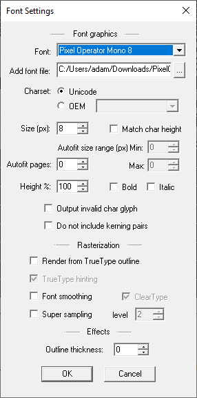
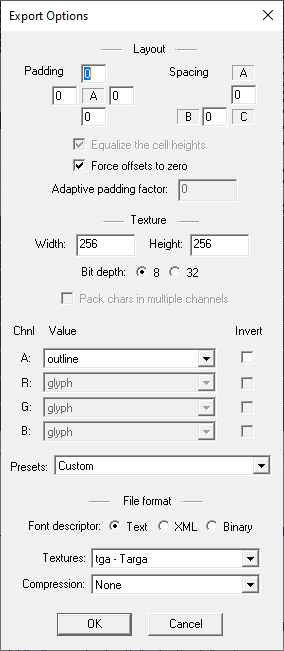

# Vector fonts converted to 8 bit bitmap

This repo consists of individual fonts that look pixelated, but aren't actually presented in a bitmap format, for use in pixel art tools and on hardware solutions like FPGAs.

## Representation

Fonts are presented in 8x8 single bit raw bitmaps in a 16x16 tile configuration. Thus it goes tile 0 row 0, then tile 1 row 0, ..., tile 15 row 0, where it wraps to tile 0 row 1.

These fonts can be viewed in a tool such as [PixelFont Editor](https://www.min.at/prinz/o/software/pixelfont/).


## Conversion Process

### BMFont

The first part of conversion uses [Bitmap Font Generator (BMFont)](http://www.angelcode.com/products/bmfont/). We will generate a texture to be used by the next tool.

1. Open the program and go to `Options/Font settings`
2. Select your font. If it isn't installed, select the font file in the `Add font file` field, then select it in the `Font` dropdown. Note that the fonts are alphabetized
3. Set `Size (px)` to `8px`
4. Disable `Font smoothing`



1. Close the `Font Settings` dialog, and go to `Options/Export options`
2. Set both `Spacing` fields to 0
3. Enable `Force offsets to zero`



1. Clsoe the `Export Options` dialog
2.  Choose your character set on the righthand side. You probably just want Latin for basic use
3.  Select `Options/Save bitmap font as...`. Choose a filename

This will create two files, `[filename].fnt` and `[filename]_0.tga`

### Monobit

This output can now be processed by the [Monobit](https://github.com/robhagemans/monobit) Python tool.

1. Install Monobit by running `pip install monobit` in the appropriate venv.
2. Convert the data into a raw bitmap
```bash
monobit-convert --format=bmfont [input filename].fnt to --format=raw [output filename].pf
```

The font should now be in a usable bitmap format.

## Licensing

I do not own any of these fonts. They are all freely licensed in their original licenses:

| Font                | Source                                                                                                   | License |
| ------------------- | -------------------------------------------------------------------------------------------------------- | ------- |
| `PixelOperatorMono` | [https://notabug.org/HarvettFox96/ttf-pixeloperator](https://notabug.org/HarvettFox96/ttf-pixeloperator) | CC0     |
